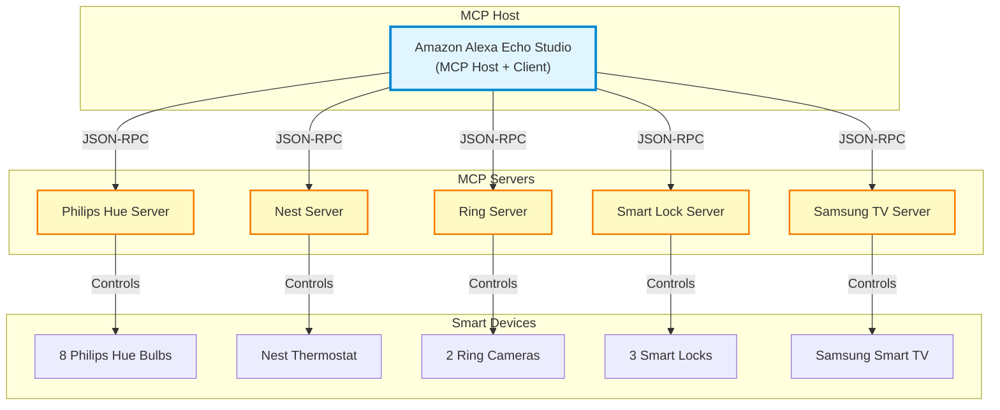

## Smart Home MCP Architecture Exercise (Solution)

## 1. Identify Smart Home Components and Map to MCP Roles

- **List the components of a Smart Home System**
    - Amazon Alexa Echo Studio
Devices: 
    - 8 Philips Hue smart bulbs
    - 1 Nest Thermostat
    - 2 Ring cameras (front door, backyard)
    - 3 Smart locks (front, back, garage)
    - 1 Samsung Smart TV

- **Map to MCP architecture and visualize the relationship**: Amazon Alexa Echo Studio acts as the Host to orchestrate connections to all the connected devices. Each connected device can be considered an MCP Server that has functionality like "turn on/off lights", "lock/unlock" the doors, etc. Each functionality can be considered a tool. See the diagram below.



## 2. Trace Communication Patterns Using JSON-RPC

- **Map a simple interaction**: 
- **Identify request/response pairs**: 

Step 1: "Alexa, turn on living room lights"
- User (Voice) → Host (Echo Studio)
- Request: `processVoiceCommand`
- Response: 
```
  "result": {
    "status": "success",
    "deviceIDs": ["hue_bulb_3", "hue_bulb_4", "hue_bulb_5"]
  }

```

Step 2: Host → Client → Server (Philips Hue)
- Request:
```
{
  "jsonrpc": "2.0",
  "id": 2,
  "method": "tools/call",
  "params": {
    "name": "setLightState",
    "arguments": {
      "deviceIDs": ["hue_bulb_3", "hue_bulb_4", "hue_bulb_5"],
      "state": "on",
      "brightness": 100,
      "transition": 0.5
    }
  }
}

```
- Response:
```
{
  "jsonrpc": "2.0",
  "id": 2,
  "result": {
    "content": [
      {
        "type": "text",
        "text": "Successfully turned on 3 lights in living room"
      }
    ]
  }
}

```

Step 3: Host (Echo Studio) → User

- Response:
```
{
  "jsonrpc": "2.0",
  "method": "notifications/message",
  "params": {
    "level": "info",
    "message": "Okay, turning on living room lights"
  }
}

```

## 3. Categorize Smart Home Capabilities into MCP Primitives

```mermaid
graph LR
    subgraph "Philips Hue Server"
        HueResources["📊 Resources<br/>• Current brightness<br/>• Color state<br/>• Power status"]
        HueTools["🔧 Tools<br/>• turn_on()<br/>• turn_off()<br/>• set_brightness()<br/>• set_color()"]
        HuePrompts["💡 Prompts<br/>• 'Dim lights for movie'<br/>• 'Bright for reading'"]
    end
    
    subgraph "Smart Lock Server"
        LockResources["📊 Resources<br/>• Lock status<br/>• Battery level<br/>• Access logs"]
        LockTools["🔧 Tools<br/>• lock()<br/>• unlock()<br/>• get_status()"]
        LockPrompts["💡 Prompts<br/>• 'Secure home'<br/>• 'Unlock front door'"]
    end
    
    subgraph "Nest Server"
        NestResources["📊 Resources<br/>• Current temp<br/>• Target temp<br/>• HVAC mode"]
        NestTools["🔧 Tools<br/>• set_temperature()<br/>• set_mode()<br/>• get_status()"]
        NestPrompts["💡 Prompts<br/>• 'Goodnight mode'<br/>• 'Energy save'"]
    end
    
    style HueResources fill:#e8f5e9,stroke:#4caf50
    style HueTools fill:#fff3e0,stroke:#ff9800
    style HuePrompts fill:#f3e5f5,stroke:#9c27b0
    style LockResources fill:#e8f5e9,stroke:#4caf50
    style LockTools fill:#fff3e0,stroke:#ff9800
    style LockPrompts fill:#f3e5f5,stroke:#9c27b0
    style NestResources fill:#e8f5e9,stroke:#4caf50
    style NestTools fill:#fff3e0,stroke:#ff9800
    style NestPrompts fill:#f3e5f5,stroke:#9c27b0
```



## 4. Evaluate and Select Transport Mechanisms

- **Analyze connection requirements**:
- **Match transport to use case**:

**Analysis by Device Type:**

| Device | Connection Type | Latency Need | Bidirectional? | Recommended Transport |
|--------|----------------|--------------|----------------|----------------------|
| Philips Hue Lights | Local network | Low | Yes | Real-time |
| Nest Thermostat | Cloud | Medium | Yes | Streamable HTTP |
| Ring Cameras | Cloud | Real-time | Yes | Real-time |
| Smart Locks | Local | Low | Yes | Real-time |
| Automation Scripts | Local | Low | No | stdio |
| Mobile App | Remote | Medium | Yes | Streamable HTTP |
